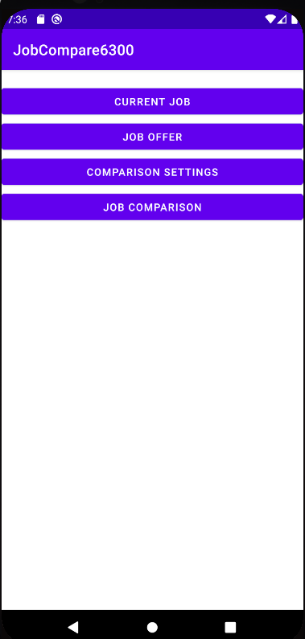
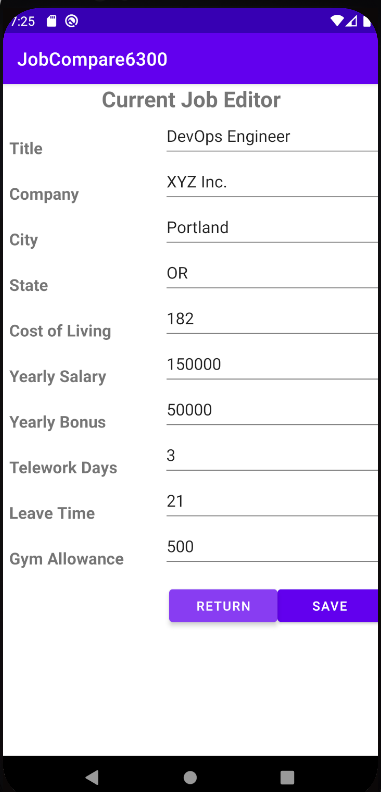
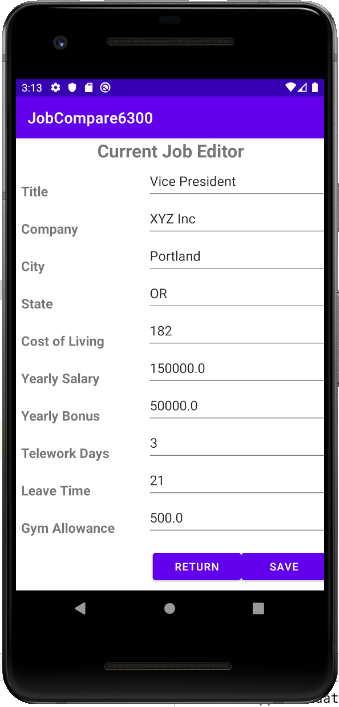
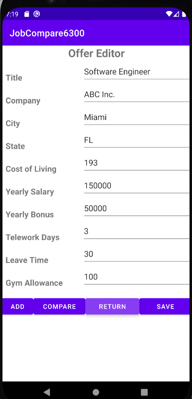
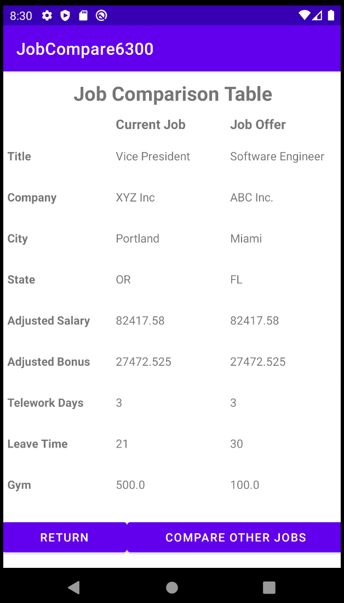
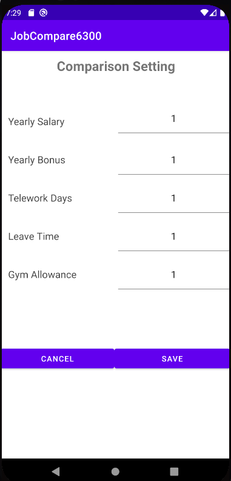
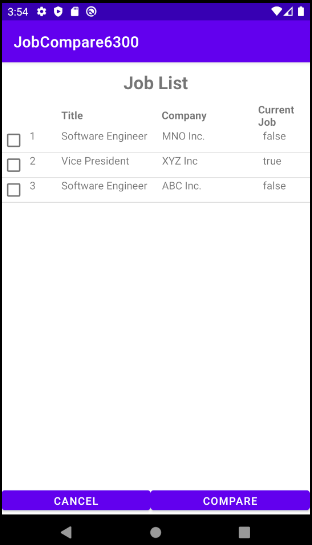
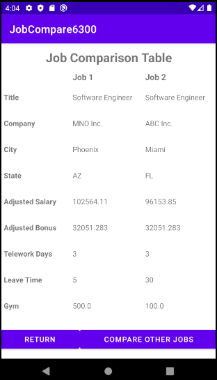

# JobCompare6300 Software User Manual

**Update Date**: Oct 21, 2021

**Team Number**: 129

**Team Member**: Diana Sari, Yufeng Xing, Huimei Huang, Garret King

**Revision**: Week 4 Deliverable 4 - Modified to a more detailed manual.

**Version**: v1.0

----------

#### 1. How to Start?

* Download and install the APK of the app. 

* Then click on the APP icon to open it.

* Then the main menu activity will be displayed in the view.

* **(Optional)** If you want to do local buildings, please make sure you have met all the requirements we have as follows in your environment:

  * Android Development Environment: Android Studio 2020.3.1
  * Version Control System: Git and GitHub
  * Android SDK Platform: Android 10.0 (Q) or above
  * Android Room: 2.3.0 or above
  * API Level: 29 to 31
  * CPU/ABI: x86
  * Resolution: 1080 × 1920 420dpi
  * Database: Android SQLite
  * Standard Device: Google Pixel 2
  * Testing Environment: Junit 4.12

* **(Optional)** The end user need to compile the APP with the local Android Studio if you want to self-build the APP. The user can also use the AVDs to modifying, enhancing, or debuging.
 
   
 

#### 2. Add Your Current Job

* Click on the `CURRENT JOB` button.

* Enter all the information required for that current job. Make sure all the inputs meet the following standard,

  * Cost of living should be the price index listed on [this website](https://www.expatistan.com/cost-of-living/index/north-america)
  * Yearly salary should be a positive value in USD
  * Yearly bonus should be a positive value in USD
  * Telework days should be an integer between 0 and 5
  * Leave Time means the days left for leaving. It should be a positive integer
  * Gym allowance should be a positive value between 0 and 500 in USD

* If you did not fill in all the blanks, you are not able to click on the `SAVE` button.

* If you finished filling the blanks, you can click on the `SAVE` button to save your current job information into the database.

* If you want to discard the information you filled without saving them into the database, you can click on the `RETURN ` button to go back to the main menu.
 
   
 

#### 3. Update Your Current Job

* When there is a record of current job saved in the database, the Current Job Editor view will be prefilled with that information in the database.
* For example, if we saved the information shown in the previous picture, and we would like to modify the title of the current because we may be promoted as the Vice President. What we can do is,
  * Click on the `CURRENT JOB` button
  * Change the title name to Vice President
  * Click on save to update your current job information
 
 
 
 
 
 
 
 
 
 
 
 
 

#### 4. Adding Your First Job Offer

* After you receive your first job offer, it would be nice to save it in our APP.
* Click on the `JOB OFFER` button in the main menu.
* Fill in the information of your first job offer
* Then you will have to choose one of four buttons to click on. Different buttons will be used for different purposes.
  * `ADD` button: It means that the current information in this view will be saved in the database. Then, instead of going back to the main menu, the current view will be reset to empty and you can add one more offer. If you want to save and go back to the main menu, you have to click on the `SAVE` button.
  * `COMPARE` button: It means that the current offer information will be compared with the current job information in the database. This button will be grey and disabled if you don't have a current job in the database.
  * `RETURN` button: It means to discard the information filled in the blanks and the data will not be saved in the database
  * `SAVE` button: It means that you can save your current data to the database and then return back to the main menu.
* You can simply add more offers following the same procedure.
 
 
 
 
 

#### 5. Comparing The First Offer with The Current Job

* As we have mentioned, you can click on the `COMPARE` button to compare the offer with the current job.
* From this view, you can compared the detailed information of them in a table.
* You will then have two buttons to choose,
  * `RETURN` button: This means we will return back to the main menu, and the offer information you have entered will not be saved to the data. Be careful about it because there are risks to lose all your data.
  * `RETURN TO EDITOR` button: This is a button for you to return back to the last view Offer Editor. Then in the Offer Editor view, you are able to save the offer information to the database or add a new offer
 
 
 
 
 
 
 
 
 
 
 

#### 6. Modify the Weight Settings

* In the main menu, we can modify the ranking weights by click on the `COMPARISON SETTINGS` button.
* Initially, all the weights will be set to 1.
<!-- * The score used to rank all the jobs follows the formula,

> AYS + AYB + GYM + (LT * AYS / 260) - ((260 - 52 * RWT) * (AYS / 260) / 8)

* Where,	
  * AYS means the adjusted yearly salary based on the cost of living
  * AYB means the adjusted yearly bonus based on the cost of living
  * GYM means the gym allowance
  * LT means the leaving time
  * RWT means the telework days -->

* All the weights have to be non-negative integers and they will have the same unit when calculating the score for ranking

* There are two buttons for users to choose,
  * `CANCEL` button: It means to discard the current modification and return back to the main menu.
  * `SAVE` button: It means to save the current settings data into the database.
 
 
 
 
 
 

#### 7. List and Rank All Your Jobs

* If you don't have more than two jobs (including the current job) in the database, you can not click on the `JOB COMPARISON` button.
* If you have more than two jobs (including the current job) in the database, you can click on the `JOB COMPARISON` button to generating a rank of all the jobs/offers you have in the database.
* This rank will based on the formula we have discussed, and it will depend on the weight we have assigned in the Comparison Setting view.
* Only a brief information of each job is shown in this list. These include,
  * Rank position: 1/2/3 ...
  * Title
  * Company
  * Current Job: if the current line of record is our current job, this field will be `true`. Or if this record an offer, this field will be `false`.

* If we click on `CANCEL` button, we will go back to the main menu.
* Or we can select two jobs for detailed comparison. Let's say if we want to select the job of MNO and the job of ABC, we can click to check the boxes behind both of these records. We must check and can only check two jobs at one time.
* After selecting these two jobs, we can click on the `COMPARE` button to compare them in a detailed way.
 
 
 

#### 8. View Your Detailed Compared Jobs

* After you click on the `COMPARE` button in the last step, you can view the detailed information of these two jobs you have selected.
* In this view, we have two button we can select,
  * `RETURN` button: It means we will be taken back to the main menu.
  * `COMPARE OTHER JOBS` button: It means we will be taken back to the last step of the job rank. 
 
 
 
 
 
 
 
 

